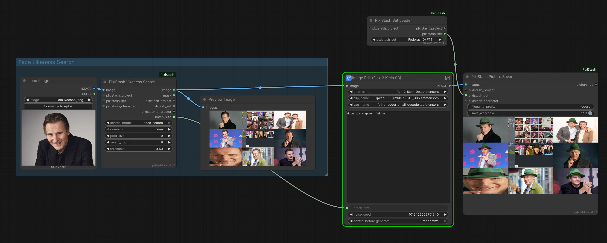
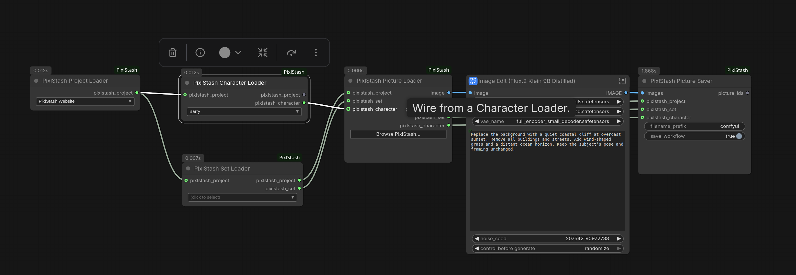
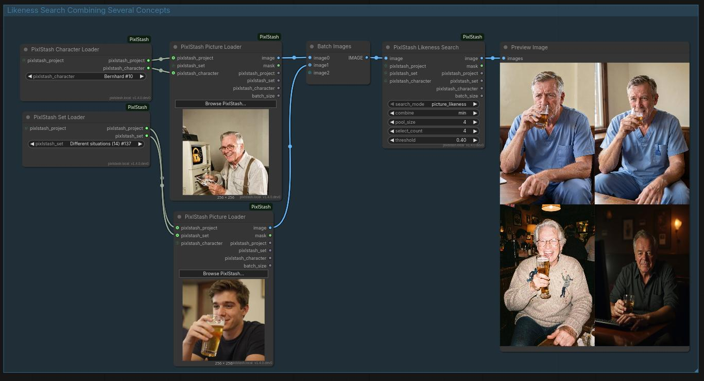
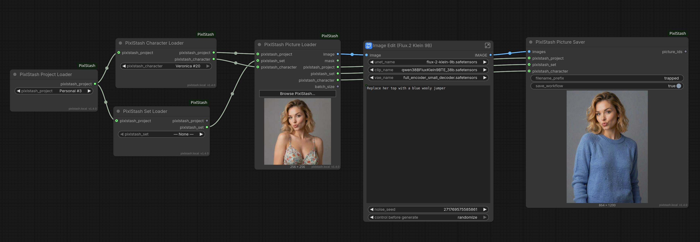
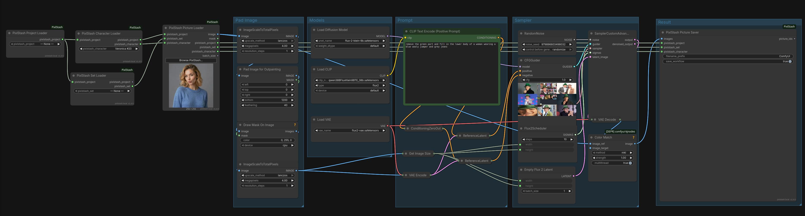
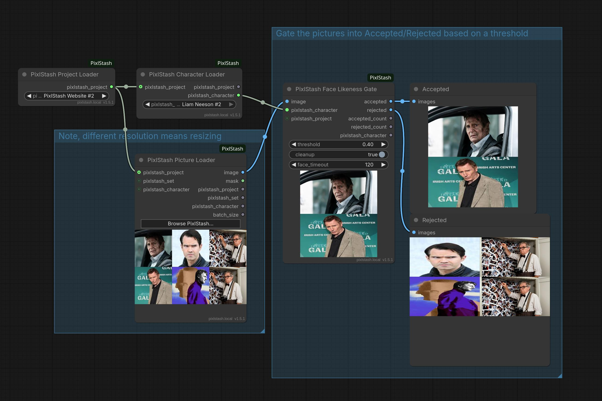
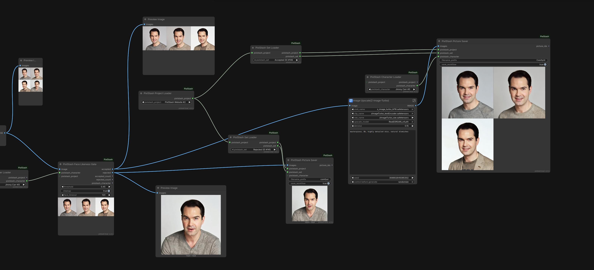
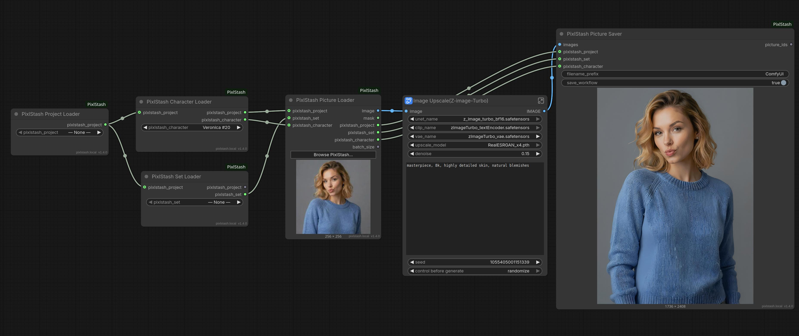
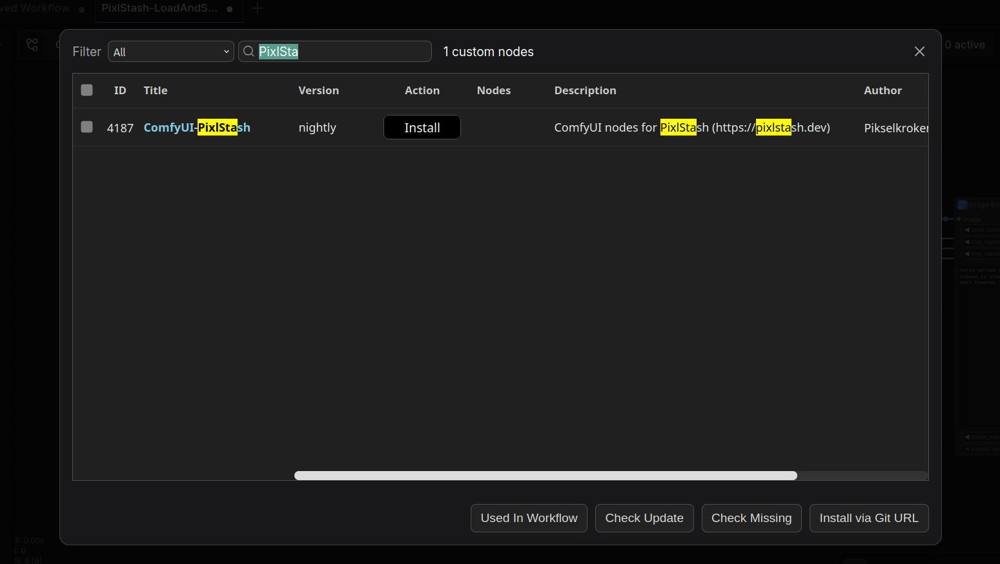

<div align="center">
  <a href="https://pixlstash.dev"></a>
  <h1>ComfyUI-PixlStash</h1>
  <p>Custom ComfyUI nodes for loading and saving images to a PixlStash vault.</p>
  <p>
    <a href="https://pixlstash.dev"><strong>pixlstash.dev</strong></a>
    &nbsp;&nbsp;|&nbsp;&nbsp;
    <a href="https://github.com/Pikselkroken/pixlstash"><strong>github.com/Pikselkroken/pixlstash</strong></a>
  </p>
</div>

---

<div align="center">
  <a href="examples/PixlStash-SearchImageEdit.json"></a>
  <p><sub>Semantic search → image edit, end to end. <a href="examples/PixlStash-SearchImageEdit.json">Open this workflow</a>.</sub></p>
</div>



[Download example workflow](PixlStash-LoadAndSave.json)

## Overview

ComfyUI-PixlStash connects your ComfyUI workflows directly to a PixlStash vault. You can browse and load images by project, set, or character, run them through any pipeline, and save the results back with full metadata and optional workflow embedding.

Connection credentials (URL and API token) are configured once in **ComfyUI Settings > PixlStash** and are read by the nodes at runtime. They never appear as node widgets or in saved workflow JSON.

## Nodes

### Project Loader

Selects a project from your vault. Outputs a `PIXLSTASH_PROJECT` wire that can be passed to other nodes to scope their operations.

### Set Loader

Selects a set within a project. Outputs `PIXLSTASH_PROJECT` and `PIXLSTASH_SET` wires. Reference-character sets are excluded from the dropdown.

### Character Loader

Selects a character from your vault. Outputs `PIXLSTASH_PROJECT` and `PIXLSTASH_CHARACTER` wires.
Note this requires PixlStash v1.2.1+ to function properly as it relies on an API addition in 1.2.1.

### Picture Loader

Loads images from PixlStash as `IMAGE` and `MASK` tensors.

Two modes of operation:

- **Picker mode** -- click the Browse button to open a thumbnail browser, select one or more images, and the node loads exactly those.
- **Browse mode** -- leave the selection empty and the node fetches images automatically based on any connected project, set, or character filters.

Outputs the loaded images together with pass-through `PIXLSTASH_PROJECT`, `PIXLSTASH_SET`, and `PIXLSTASH_CHARACTER` wires so you can forward context to a downstream saver without extra wiring.

### Picture Saver

Uploads images to PixlStash and optionally assigns them to a project, set, and/or character. Supports embedded workflow metadata in PNG output. Returns the IDs of successfully imported pictures as a comma-separated string.

### Likeness Search

Search for likeness to a provided face with facial features comparison. Add the face image with LoadImage or use the PixlStash Picture Loader to load it from the PixlStash database. The following uses a picture not in the PixlStash database.


You can also use image embedding search with multiple images so you can combine concepts. An old man and a young man drinking beer. The result here is 4 older men drinking beer.



You can filter by project, character and set by providing those inputs.

**Note:** Requires PixlStash v1.4 (for now only available as development releases)

### Face Likeness Gate

Keeps only the generations that actually match a reference character. Wire a batch of generated images plus a **Character Loader** into the gate, set a likeness `threshold`, and it splits the batch into two streams — `accepted` (faces at or above the threshold) and `rejected` (off‑model renders or frames with no detectable face) — along with `accepted_count` / `rejected_count`. Route `accepted` into an upscale / save branch and send `rejected` to a "scrapheap" preview, so you never waste compute polishing a bad match.

Face likeness is scored server‑side by a single stateless endpoint: the node uploads the frames in batches, the server detects and embeds each face in‑memory on the GPU and scores it against the character's reference faces, and returns one score per frame. Nothing is imported or persisted, so scoring is fast and leaves the vault untouched — there's nothing to clean up. The reference character is passed through so an accepted branch can be saved back tagged to the same character without re‑wiring.

**Note:** Requires PixlStash v1.6.0+ (which added the stateless `score_character_likeness` endpoint the gate uses) and a running face‑extraction worker. A read-scope token is sufficient.

### Picture Likeness Gate

Splits a batch of generations into `accepted` and `rejected` outputs by judging each frame's whole-image likeness against a reference **picture set**. Wire a batch of generated images plus a **Set Loader** into the gate, pick a `combine` mode and a `threshold`, and route `accepted` into an upscale / save branch while `rejected` goes nowhere or to a "rejects" saver — so you never waste compute polishing an off-target render. Also outputs `accepted_count` / `rejected_count`, and passes the reference set through so an accepted branch can be saved straight back into the same set.

Each frame is scored against every member of the set. The `combine` mode decides how those per-member scores become one verdict — the default `min` means **must match all** (a `[monkey, banana, bicycle]` reference set keeps only frames that resemble all three), while `max` matches any one and the means fall in between.

Scoring is read-only and synchronous: each frame is sent as the query image to PixlStash's image-likeness search with the set as the corpus, so the server embeds it on the fly and ranks it against the set's members. **Nothing is uploaded to your vault, nothing is persisted, and no write scope is needed** — there's no import step and no embedding-readiness wait. (Cost is one request per frame; the reference set must have ≤ 500 members.)

**Note:** Requires PixlStash v1.4 (for now only available as development releases). A read-scope token is sufficient.

### Semantic Search

Search using a text string and the node will use PixlStash's semantic search feature to extract pictures based on similarity to the search.


You can filter by project, character and set by providing those inputs.

**Note:** Requires PixlStash v1.4 (for now only available as development releases)

## Workflow examples

Ready-to-load workflow JSON files live in the [`examples/`](examples/) directory. Click any screenshot to open its workflow.

### Search → Image Edit

Pull source images out of the vault by meaning, then run them through an edit pipeline.

[](examples/PixlStash-SearchImageEdit.json)

→ [PixlStash-SearchImageEdit.json](examples/PixlStash-SearchImageEdit.json)

### Outpaint

Extend a loaded vault image beyond its original frame.

[](examples/PixlStash-Outpaint.json)

→ [PixlStash-Outpaint.json](examples/PixlStash-Outpaint.json)

### Face Likeness Gate

Filter a batch of generations down to only the frames that match a reference character, previewing the accepted and rejected streams side by side.

[](examples/PixlStash-FaceLikenessGate.json)

→ [PixlStash-FaceLikenessGate.json](examples/PixlStash-FaceLikenessGate.json)

Or run it end to end: generate with a character LoRA, gate by face likeness, then upscale the accepted frames and save the accepted and rejected streams back to separate sets.

[](examples/PixlStash-FaceLikenessGate-Upscale.json)

→ [PixlStash-FaceLikenessGate-Upscale.json](examples/PixlStash-FaceLikenessGate-Upscale.json)

### Picture Likeness Gate

Generate wide, keep only the frames that match a reference picture set, and preview the accepted and rejected streams side by side — no vault writes required.

→ [PixlStash-PictureLikenessGate.json](examples/PixlStash-PictureLikenessGate.json)

### Upscale

Upscale a vault image and save the result back with metadata intact.

[](examples/PixlStash-Upscale.json)

→ [PixlStash-Upscale.json](examples/PixlStash-Upscale.json)

## Installation

### Via ComfyUI Manager (recommended)

Search for **ComfyUI-PixlStash** in the Custom Nodes Manager and click Install.



### Manual

Clone this repository into your ComfyUI `custom_nodes` directory:

```bash
cd custom_nodes
git clone https://github.com/Pikselkroken/ComfyUI-PixlStash.git
```

After installation, restart ComfyUI and configure your PixlStash URL and API token under **Settings > PixlStash**.

## Configuration

| Setting | Description |
|---|---|
| URL | Base URL of your PixlStash instance |
| API Token | Token with the required read or write scope |
| Verify SSL | Whether to validate the server certificate |

> **Multi-user is not supported.** PixlStash doesn't work with ComfyUI's
> `--multi-user` mode. ComfyUI doesn't tell a node which user submitted the
> running prompt, so the nodes can't pick that user's token and refuse to run
> rather than risk using someone else's. Run a separate single-user ComfyUI
> instance for each PixlStash user.

## Development

Run the test suite (stdlib `unittest`, no running ComfyUI required):

```bash
python -m unittest discover -s tests
```

The tests stub ComfyUI's runtime modules, so only `requests` needs to be
installed (`pip install -r requirements.txt`). They cover the security-sensitive
paths: the multi-user guard, the proxy SSRF/auth checks, loader id extraction,
and Picture Saver path containment.

Lint and format with [ruff](https://docs.astral.sh/ruff/):

```bash
ruff check .
ruff format .
```

## License

Open Source MIT License. See [LICENSE](LICENSE).
