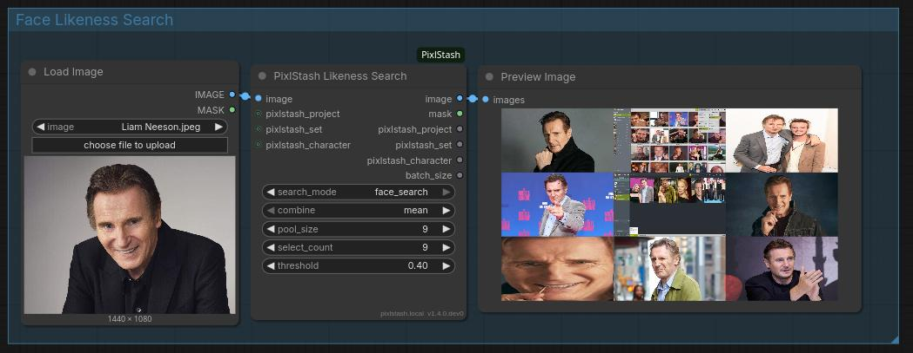
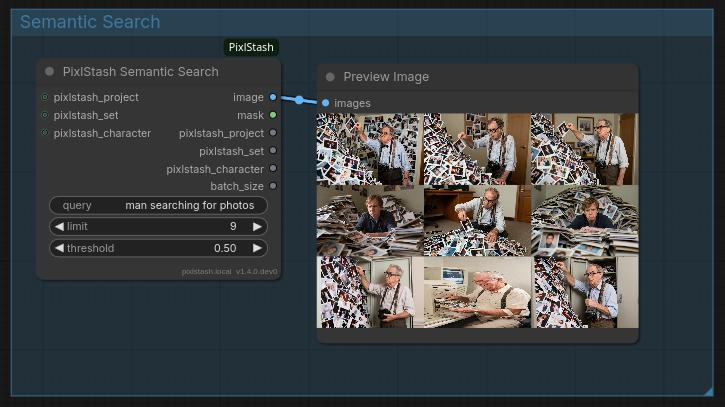

<div align="center">
  <a href="https://pixlstash.dev"></a>
  <h1>ComfyUI-PixlStash</h1>
  <p>Custom ComfyUI nodes for loading and saving images to a PixlStash vault.</p>
  <p>
    <a href="https://pixlstash.dev"><strong>pixlstash.dev</strong></a>
    &nbsp;&nbsp;|&nbsp;&nbsp;
    <a href="https://github.com/Pikselkroken/pixlstash"><strong>github.com/Pikselkroken/pixlstash</strong></a>
  </p>
</div>

---


[Download example workflow](PixlStash-LoadAndSave.json)

## Overview

ComfyUI-PixlStash connects your ComfyUI workflows directly to a PixlStash vault. You can browse and load images by project, set, or character, run them through any pipeline, and save the results back with full metadata and optional workflow embedding.

Connection credentials (URL and API token) are configured once in **ComfyUI Settings > PixlStash** and are injected automatically at runtime. They never appear as node widgets.

## Nodes

### Project Loader

Selects a project from your vault. Outputs a `PIXLSTASH_PROJECT` wire that can be passed to other nodes to scope their operations.

### Set Loader

Selects a set within a project. Outputs `PIXLSTASH_PROJECT` and `PIXLSTASH_SET` wires. Reference-character sets are excluded from the dropdown.

### Character Loader

Selects a character from your vault. Outputs `PIXLSTASH_PROJECT` and `PIXLSTASH_CHARACTER` wires.
Note this requires PixlStash v1.2.1+ to function properly as it relies on an API addition in 1.2.1.

### Picture Loader

Loads images from PixlStash as `IMAGE` and `MASK` tensors.

Two modes of operation:

- **Picker mode** -- click the Browse button to open a thumbnail browser, select one or more images, and the node loads exactly those.
- **Browse mode** -- leave the selection empty and the node fetches images automatically based on any connected project, set, or character filters.

Outputs the loaded images together with pass-through `PIXLSTASH_PROJECT`, `PIXLSTASH_SET`, and `PIXLSTASH_CHARACTER` wires so you can forward context to a downstream saver without extra wiring.

### Picture Saver

Uploads images to PixlStash and optionally assigns them to a project, set, and/or character. Supports embedded workflow metadata in PNG output. Returns the IDs of successfully imported pictures as a comma-separated string.

### Likeness Search

Search for likeness to a provided face with facial features comparison. Add the face image with LoadImage or use the PixlStash Picture Loader to load it from the PixlStash database. The following uses a picture not in the PixlStash database.



You can also use image embedding search with multiple images so you can combine concepts. An old man and a young man drinking beer. The result here is 4 older men drinking beer.


You can filter by project, character and set by providing those inputs.

### Semantic Search

Search using a text string and the node will use PixlStash's semantic search feature to extract pictures based on similarity to the search.



You can filter by project, character and set by providing those inputs.

## Installation

### Via ComfyUI Manager (recommended)

Search for **ComfyUI-PixlStash** in the Custom Nodes Manager and click Install.


### Manual

Clone this repository into your ComfyUI `custom_nodes` directory:

```bash
cd custom_nodes
git clone https://github.com/Pikselkroken/ComfyUI-PixlStash.git
```

After installation, restart ComfyUI and configure your PixlStash URL and API token under **Settings > PixlStash**.

## Configuration

| Setting | Description |
|---|---|
| URL | Base URL of your PixlStash instance |
| API Token | Token with the required read or write scope |
| Verify SSL | Whether to validate the server certificate |

## License

Open Source MIT License. See [LICENSE](LICENSE).
