<div align="center">
  <a href="https://pixlstash.dev"></a>
  <h1>ComfyUI-PixlStash</h1>
  <p>Custom ComfyUI nodes for loading and saving images to a PixlStash vault.</p>
  <p>
    <a href="https://pixlstash.dev"><strong>pixlstash.dev</strong></a>
    &nbsp;&nbsp;|&nbsp;&nbsp;
    <a href="https://github.com/Pikselkroken/pixlstash"><strong>github.com/Pikselkroken/pixlstash</strong></a>
  </p>
</div>

---

<div align="center">
  <a href="examples/PixlStash-SearchImageEdit.json">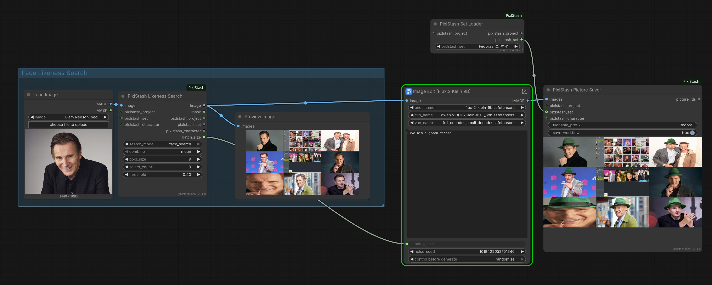</a>
  <p><sub>Semantic search to image edit, end to end. <a href="examples/PixlStash-SearchImageEdit.json">Open this workflow</a>.</sub></p>
</div>

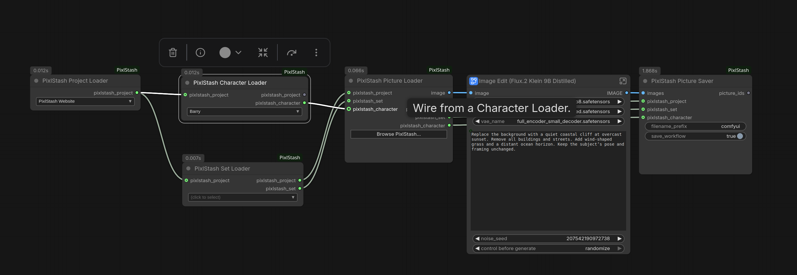

[Download example workflow](PixlStash-LoadAndSave.json)

## Overview

These nodes connect ComfyUI to a PixlStash vault. Load images by project, set or
character, run them through any pipeline, and save the results back with
metadata. Models can be loaded from the PixlStash model shelf too.

Set the URL and API token once in **ComfyUI Settings > PixlStash**. The nodes
read them at runtime, so they never end up in saved workflow JSON.

## Nodes

| Node | What it does | Added in | Needs PixlStash |
|---|---|---|---|
| Project Loader | Picks a project. Outputs a wire to scope other nodes. | 1.0 | 1.0 |
| Set Loader | Picks a set inside a project. | 1.0 | 1.0 |
| Character Loader | Picks a character. | 1.0 | 1.2.1 |
| Picture Loader | Loads images as `IMAGE` and `MASK`. Pick them in a thumbnail browser, or leave the selection empty to fetch everything matching the wired filters. | 1.0 | 1.0 |
| Picture Saver | Uploads images, optionally filed under a project, set or character. Can embed the workflow in PNGs. | 1.0 | 1.0 |
| Likeness Search | Finds pictures by facial or image similarity to reference images. | 1.1 | 1.4 |
| Semantic Search | Finds pictures by text. | 1.1 | 1.4 |
| Face Likeness Gate | Splits a batch into `accepted` and `rejected` by how well each face matches a character. | 1.2 | 1.6 |
| Picture Likeness Gate | Same, judged on whole-image likeness to a reference picture set. | 1.3.1 | 1.4 |
| Adapter (LoRA) Loader | Applies a LoRA from the model shelf. | 1.5 | 1.10 |
| Checkpoint Loader | Loads a checkpoint from the model shelf. | 1.5 | 1.10 |
| VAE Loader | Loads a VAE from the model shelf. | 1.5 | 1.10 |
| CLIP Loader | Loads one or two text encoders from the model shelf. | 1.5 | 1.10 |

"Added in" is the ComfyUI-PixlStash version. The Face Likeness Gate also needs a
running face-extraction worker.

The search and gate nodes take optional project, set and character inputs as
filters. The loaders pass their context through, so a saver downstream needs no
extra wiring.

### Search

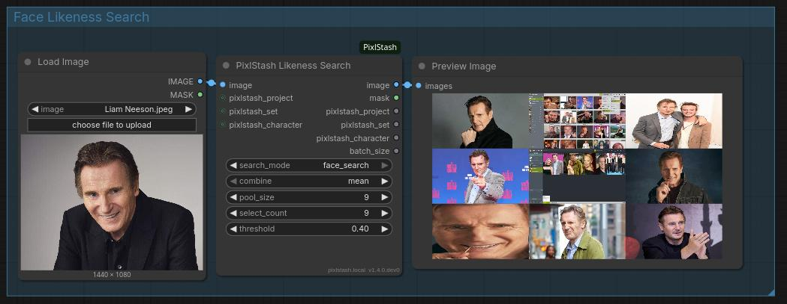

Image search takes several images at once, so you can combine concepts. "An old
man and a young man drinking beer" returns four older men drinking beer:

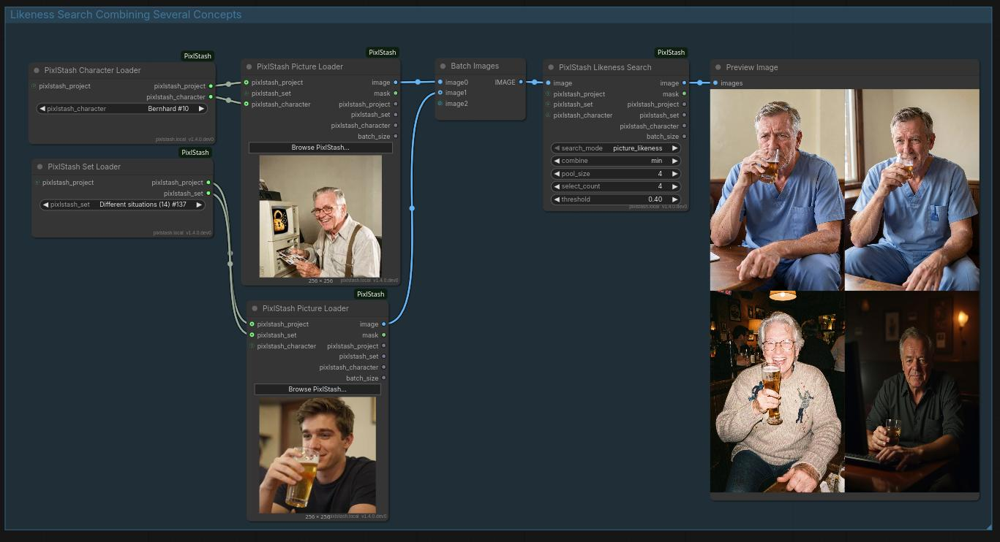

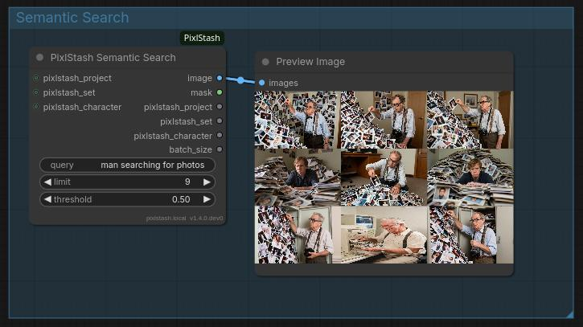

### Gates

Wire in a batch of generations plus a Character Loader (face) or Set Loader
(picture), set a `threshold`, and route `accepted` to an upscale or save branch
so you never waste compute on a bad match. Both also output
`accepted_count` / `rejected_count` and pass the reference through.

The Picture Likeness Gate's `combine` mode decides how per-member scores become
one verdict: `min` (default) means match every member of the set, `max` means
match any.

Both score server-side and write nothing to the vault. A read-scope token is
enough.

### Model shelf loaders

Pick models from a thumbnail grid instead of a dropdown of hundreds of
filenames. Each loader has the same inputs and outputs as its ComfyUI built-in,
so it drops straight into an existing graph. The Adapter Loader adds a
`trigger_words` output.

Once picked, the node shows the model's name and picture, so a graph with four
loaders stays readable.

[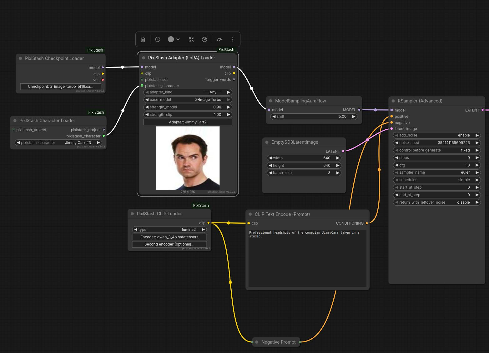](examples/PixlStash-FaceLikenessGateUpscaleModels.json)

Wire a Set or Character Loader into the Adapter Loader to see only that
character's or set's adapters.

Files are used in place when ComfyUI and PixlStash share a filesystem. Adapters,
VAEs and text encoders are otherwise fetched once and cached under
`pixlstash/<sha256>.safetensors` in the matching models directory, verified
against the digest. **Checkpoints cannot be fetched** and must be readable
locally.

**Note:** the shelf needs an owner token. Resource-scoped share tokens get a 403.

## Workflow examples

Ready-to-load JSON lives in [`examples/`](examples/). Click a screenshot to open
its workflow.

**Search to image edit.** Pull images out of the vault by meaning, then edit them.

[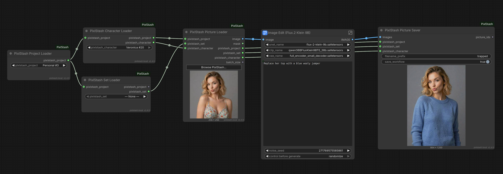](examples/PixlStash-SearchImageEdit.json)

**Outpaint.** Extend a vault image beyond its frame.

[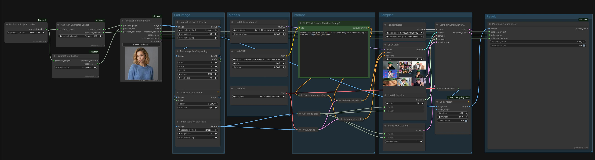](examples/PixlStash-Outpaint.json)

**Face Likeness Gate.** Keep only the frames matching a character.

[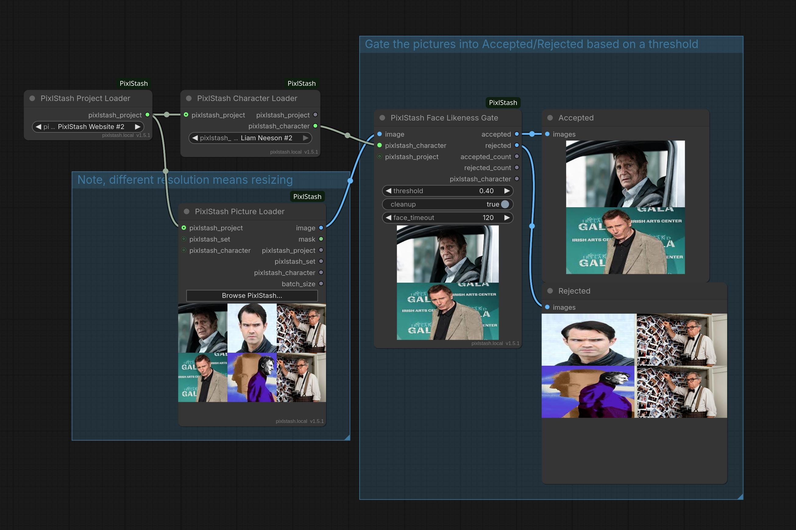](examples/PixlStash-FaceLikenessGate.json)

Or end to end: generate with a character LoRA, gate, upscale the matches, save
both streams to separate sets.

[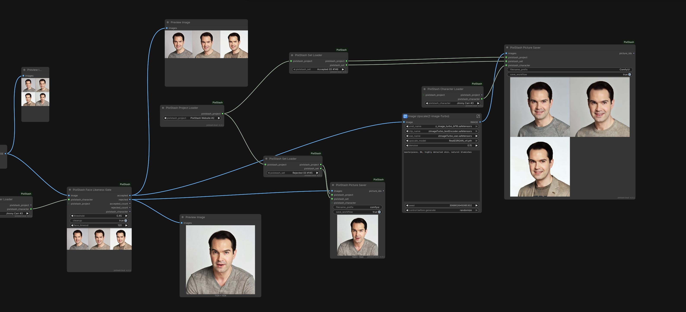](examples/PixlStash-FaceLikenessGate-Upscale.json)

The same pipeline with every model off the shelf:

[](examples/PixlStash-FaceLikenessGateUpscaleModels.json)

**Picture Likeness Gate.** Keep only the frames matching a reference set:
[bare](examples/PixlStash-PictureLikenessGate.json), or with upscale and save:

[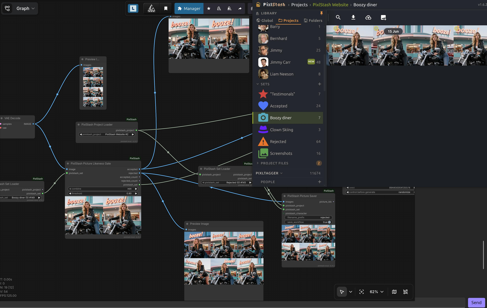](examples/PixlStash-PictureLikenessGateUpscale.json)

**Upscale.** Upscale a vault image and save it back with metadata intact.

[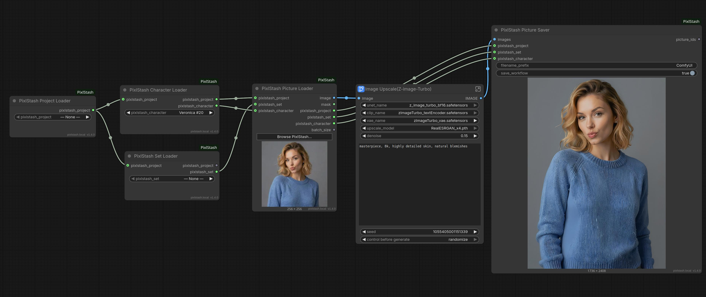](examples/PixlStash-Upscale.json)

**Generate from the model shelf.** Checkpoint, VAE and text encoder all picked
from a Browse grid, render saved straight into a project.

[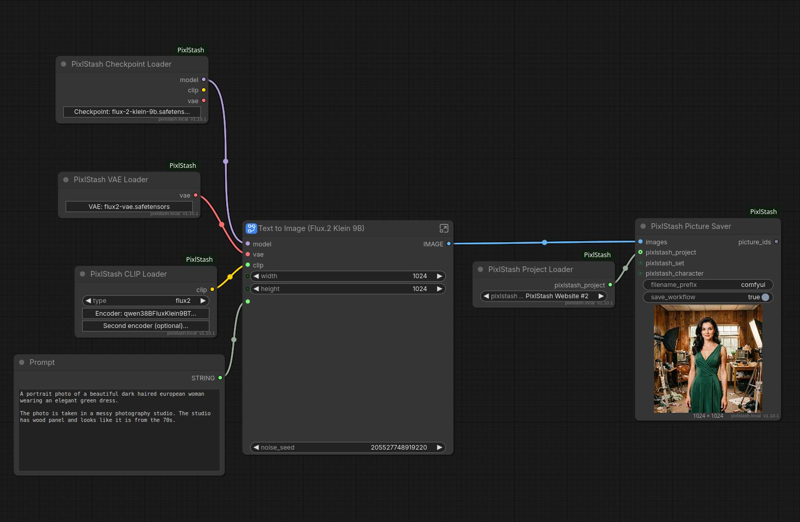](examples/PixlStash-Flux2-Models.json)

Some of these use subgraphs, so they need a recent ComfyUI. Bare diffusion
models like Flux.2 Klein 9B and Z-Image Turbo are filed as checkpoints, so only
the Checkpoint Loader's `model` output is wired and `clip` and `vae` come from
their own loaders.

## Installation

Search for **ComfyUI-PixlStash** in the ComfyUI Manager and click Install.

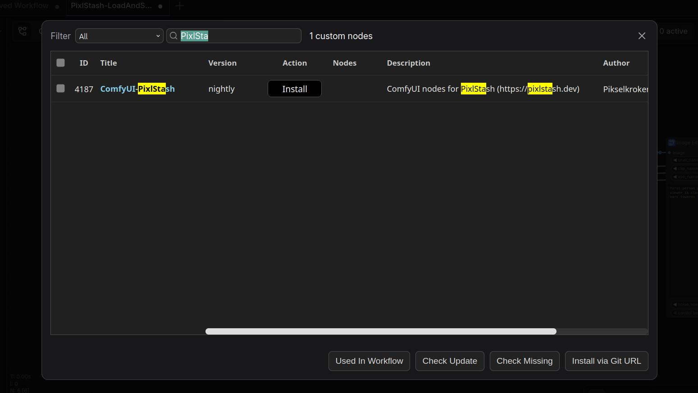

Or manually:

```bash
cd custom_nodes
git clone https://github.com/Pikselkroken/ComfyUI-PixlStash.git
```

Restart ComfyUI, then set your URL and API token under **Settings > PixlStash**.

## Configuration

| Setting | Description |
|---|---|
| URL | Base URL of your PixlStash instance |
| API Token | Token with the required read or write scope |
| Verify SSL | Whether to validate the server certificate |

> **Multi-user is not supported.** ComfyUI doesn't tell a node which user
> submitted the running prompt, so the nodes refuse to run rather than risk
> using someone else's token. Run one single-user ComfyUI per PixlStash user.

## Development

```bash
python -m unittest discover -s tests   # stdlib unittest, no ComfyUI needed
ruff check . && ruff format .
```

The tests stub ComfyUI's runtime modules, so only `requests` needs installing
(`pip install -r requirements.txt`). They cover the security-sensitive paths:
the multi-user guard, the proxy SSRF and auth checks, loader id extraction, and
path containment and digest verification in the savers and loaders.

## License

MIT. See [LICENSE](LICENSE).

**No ComfyUI source is copied into this repository.** ComfyUI is GPL-3.0 and
this package is MIT, so everything here is written against ComfyUI's public
APIs: `comfy.utils` / `comfy.sd` for the model loaders, `folder_paths`,
`server.PromptServer` for the `/pixlstash/*` proxy, and `app.registerExtension`
plus LiteGraph for the frontend. The loaders mirror the *shape* of the built-ins
(inputs, outputs, widget names) so they drop into existing graphs, but none of
their code is reproduced here.

Runtime dependencies come from PyPI, never vendored:
[requests](https://pypi.org/project/requests/) (Apache-2.0) and
[Pillow](https://pypi.org/project/Pillow/) (MIT-CMU). ComfyUI supplies `torch`
and `numpy`.
